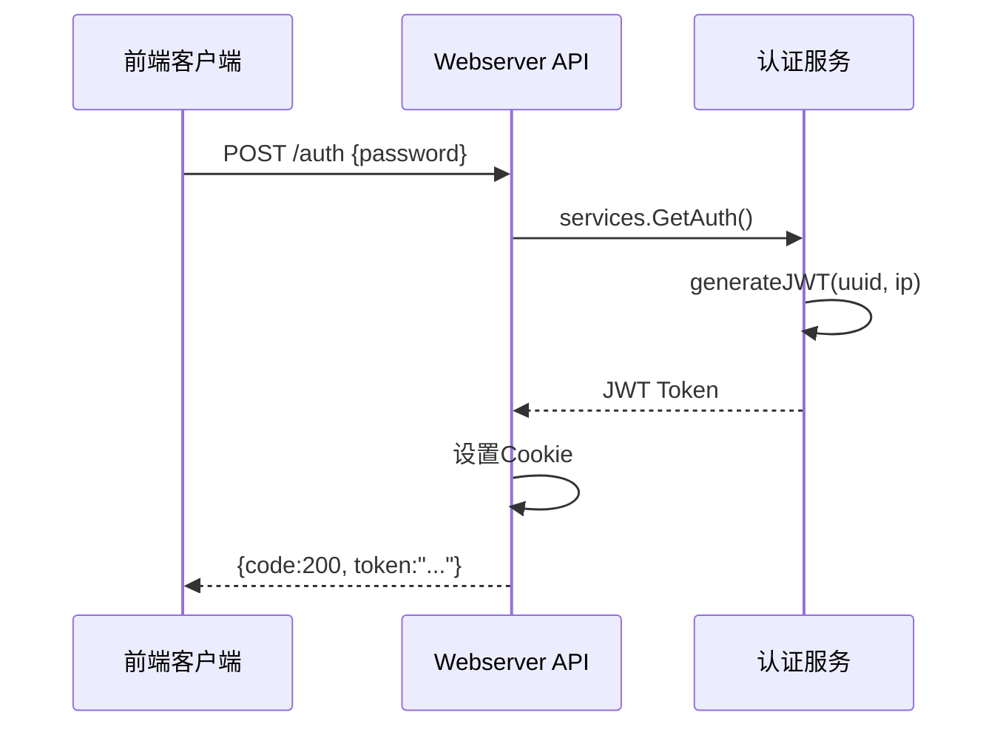
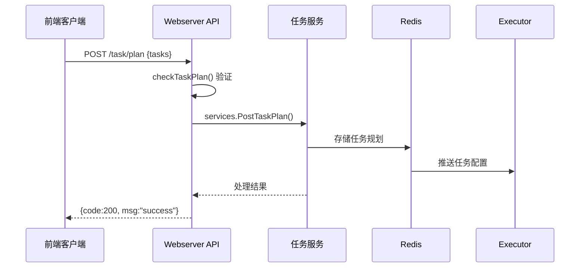
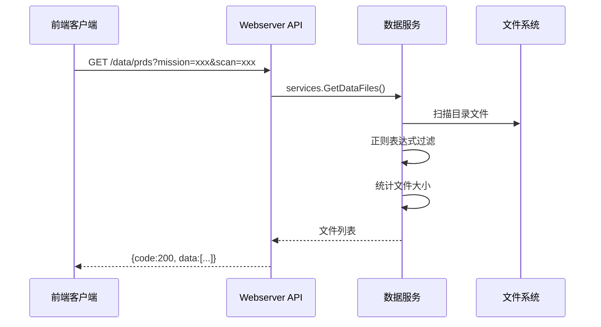
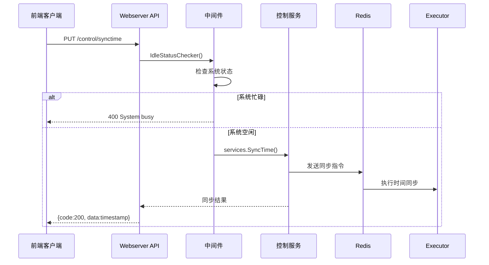

# Webserver API 完整接口文档

> **面向实习生的学习文档**  
> 本文档详细介绍webserver的所有API接口，包括接口功能、参数格式、返回值、内部实现逻辑和典型使用场景。

## 目录

- [1. 接口概览](#1-接口概览)
- [2. 认证接口](#2-认证接口)
- [3. 用户管理接口](#3-用户管理接口)
- [4. 服务器信息接口](#4-服务器信息接口)
- [5. 系统控制接口](#5-系统控制接口)
- [6. 数据管理接口](#6-数据管理接口)
- [7. 配置管理接口](#7-配置管理接口)
- [8. 宏命令管理接口](#8-宏命令管理接口)
- [9. 任务管理接口](#9-任务管理接口)
- [10. 数据结构定义](#10-数据结构定义)
- [11. 错误处理和状态码](#11-错误处理和状态码)
- [12. 典型业务流程](#12-典型业务流程)

---

## 1. 接口概览

### 1.1 基础信息
- **Base URL**: `http://192.168.8.168/api/v1`
- **数据格式**: JSON
- **认证方式**: JWT Token
- **HTTP 方法**: GET, POST, PUT, DELETE

### 1.2 接口分类

| 模块 | 路由前缀 | 说明 |
|------|---------|------|
| 认证 | `/auth` | 用户认证相关 |
| 用户管理 | `/user` | 用户CRUD操作 |
| 服务器信息 | `/server` | 服务器状态查询 |
| 系统控制 | `/control` | 系统启停、模式切换等 |
| 数据管理 | `/data` | 数据文件查询、回放控制 |
| 配置管理 | `/config` | 系统配置、任务配置等 |
| 宏命令 | `/macro` | 宏命令CRUD操作 |
| 任务管理 | `/task` | 任务规划、即时任务 |

---

## 2. 认证接口

### 2.1 用户认证

#### `POST /auth`

**功能**: 用户登录认证，获取访问令牌

**请求参数**:
```json
{
  "password": "your_password"
}
```

**返回格式**:
```json
// 成功
{
  "code": 200,
  "msg": "Auth Success",
  "token": "eyJhbGciOiJIUzI1NiIsInR5cCI6IkpXVCJ9..."
}

// 失败
{
  "code": 403
}
```

**实现逻辑**:
1. **参数验证**: 使用 `ShouldBindJSON` 绑定请求体，验证password字段
2. **JWT生成**: 调用 `services.GetAuth()` 生成包含UUID和IP的JWT令牌
3. **Cookie设置**: 将token写入HTTP Cookie，有效期3天
4. **日志记录**: 记录认证成功/失败的详细信息

**触发的服务层逻辑**:
- `services.GetAuth()` → `generateJWT()` → 使用HMAC SHA256算法签名
- 获取客户端IP地址和会话ID
- 设置令牌过期时间为24小时

**使用场景**:
- 前端用户登录
- 系统会话建立

---

## 3. 用户管理接口

### 3.1 获取用户列表

#### `GET /user/users`

**功能**: 获取系统中所有用户信息

**请求参数**: 无

**返回格式**:
```json
[
  {
    "id": 1,
    "username": "admin",
    "email": "admin@example.com",
    "created_at": "2024-01-01T00:00:00Z"
  }
]
```

### 3.2 创建用户

#### `POST /user/users`

**功能**: 创建新用户

**请求参数**:
```json
{
  "username": "newuser",
  "email": "newuser@example.com",
  "password": "password123"
}
```

### 3.3 获取指定用户

#### `GET /user/users/:id`

**功能**: 根据用户ID获取用户详细信息

**路径参数**: 
- `id`: 用户ID

---

## 4. 服务器信息接口

### 4.1 获取服务器列表

#### `GET /server/list` 🔒

**功能**: 获取系统中所有服务器的状态信息

**认证要求**: 需要JWT认证

**返回格式**:
```json
{
  "code": 200,
  "msg": "List servers success",
  "data": [
    {
      "id": 1,
      "name": "server-01",
      "status": "running",
      "ip": "192.168.1.100"
    }
  ]
}
```

---

## 5. 系统控制接口

> **重要**: 部分控制接口使用了中间件进行状态检查

### 5.1 任务控制

#### `GET /control/start`

**功能**: 启动数据采集任务

**实现逻辑**:
1. 调用 `services.StartTask()`
2. 检查系统当前状态是否允许启动
3. 通过Redis向executor发送启动指令
4. 返回任务启动状态

#### `GET /control/stop`

**功能**: 停止当前运行的任务

### 5.2 模式控制

#### `GET /control/operation/:mode`

**功能**: 切换自动/手动操作模式

**路径参数**:
- `mode`: `auto` | `manu`

**实现逻辑**:
```go
func AutoOperate(c *gin.Context) {
    mode := c.Param("mode")
    var isAuto bool
    switch mode {
    case "auto":
        isAuto = true
    case "manu":
        isAuto = false
    }
    status, err := services.AutoOperate(isAuto)
    // 返回结果处理...
}
```

#### `GET /control/controler/:mode`

**功能**: 切换远程/本地控制模式

**路径参数**:
- `mode`: `remote` | `local`

### 5.3 系统操作

#### `GET /control/poweroff`

**功能**: 系统关机

#### `GET /control/reboot`

**功能**: 系统重启

#### `GET /control/restart`

**功能**: 重启服务

### 5.4 时间同步控制 🛡️

> **注意**: 以下接口使用了 `IdleStatusChecker` 中间件，只有在系统空闲时才能执行

#### `PUT /control/syncmethod/:method`

**功能**: 设置时间同步方法

**路径参数**:
- `method`: `0` | `1` (0=内部时钟，1=外部GPS)

**中间件逻辑**: 
- 检查系统是否处于空闲状态
- 如果系统正在执行任务，返回错误

#### `PUT /control/synctime`

**功能**: 执行时间同步操作

**实现逻辑**:
1. 获取当前系统时间戳
2. 调用 `services.SyncTime(timestamp)`
3. 通过Redis向executor发送时间同步指令

#### `GET /control/selfcheck`

**功能**: 执行系统自检

---

## 6. 数据管理接口

### 6.1 数据目录查询

#### `GET /data/missions`

**功能**: 获取任务目录列表

**返回格式**:
```json
{
  "code": 200,
  "msg": "List missions success",
  "data": [
    {
      "name": "LONG_20241201",
      "is_dir": true,
      "mod_time": "2024-12-01T10:00:00Z"
    }
  ]
}
```

**实现逻辑**:
1. 读取 `SystemConfig.DataPath` 指定的数据根目录
2. 使用正则表达式过滤符合 `[a-zA-Z0-9]{4}_\d{8}` 格式的目录
3. 按修改时间倒序排列

#### `GET /data/scans?mission=xxx`

**功能**: 获取指定任务下的扫描目录列表

**查询参数**:
- `mission`: 任务目录名 (如: `LONG_20241201`)

#### `GET /data/prds?mission=xxx&scan=xxx`

**功能**: 获取指定扫描下的数据文件列表

**查询参数**:
- `mission`: 任务目录名
- `scan`: 扫描目录名

**实现逻辑**:
1. 遍历指定目录下的XML配置文件
2. 提取文件名中的关键字段作为文件组标识
3. 统计对应的.vsi/.prd文件大小
4. 根据文件扩展名判断工作模式(VSI/VSR)

### 6.2 配置文件查询

#### `GET /data/xml?file_path=xxx&mode=xxx`

**功能**: 获取数据文件的XML配置内容

**查询参数**:
- `file_path`: 文件路径
- `mode`: 工作模式 (`VSI` | `VSR`)

**返回格式**:
```json
{
  "name": "config.xml",
  "mode": "VSR",
  "sample_bits": 8,
  "band_width": 2000000,
  "channels": [
    {
      "no": 1,
      "norminal_frequency": 8450000000,
      "true_frequency": 8450000000
    }
  ]
}
```

### 6.3 数据回放控制

#### `POST /data/playback/init`

**功能**: 初始化数据回放配置

**请求参数**:
```json
{
  "file_path": "/path/to/data/file",
  "point_num": 1000,
  "mode": "VSR",
  "channels": [1, 2, 3, 4],
  "samplebits": 8,
  "bandwidth": 2000000
}
```

#### `GET /data/playback/init`

**功能**: 获取回放初始化状态

#### `POST /data/playback/plot`

**功能**: 执行绘图命令

**请求参数**:
```json
{
  "segment_index": 0,
  "figure_conf": [
    {
      "figure": 0,
      "enable": true,
      "channel": 1,
      "content": "freq",
      "window": "hanning"
    }
  ]
}
```

#### `GET /data/playback/stop`

**功能**: 停止数据回放

---

## 7. 配置管理接口

### 7.1 图形配置

#### `POST /config/figure`

**功能**: 配置图形显示参数

**请求参数**:
```json
{
  "figure": 0,
  "enable": true,
  "auto": false,
  "channel": 1,
  "window": "hanning",
  "content": "freq"
}
```

**实现逻辑**:
1. 参数验证和绑定
2. 调用 `services.ConfigFigure(&req)`
3. 通过Redis更新图形配置
4. 返回配置更新结果

### 7.2 AGC配置

#### `POST /config/analogagc/:agcID`

**功能**: 配置模拟AGC参数

**路径参数**:
- `agcID`: `agc-A` | `agc-B`

**请求参数**:
```json
{
  "is_auto": true,
  "ref_threshold": -30,
  "input_code": 1000
}
```

#### `POST /config/subbandagc`

**功能**: 配置子带AGC参数

**请求参数**:
```json
{
  "AGC_A": {
    "is_auto": true,
    "ref_threshold": -30,
    "control": [
      {
        "channel_id": "AD1-1",
        "code": 1000
      }
    ]
  },
  "AGC_B": {
    "is_auto": false,
    "ref_threshold": -25,
    "control": []
  }
}
```

### 7.3 任务配置

#### `POST /config/task`

**功能**: 配置任务参数

**请求参数**:
```json
{
  "start_ts": 1704067200000,
  "stop_ts": 1704070800000,
  "observation_num": 1,
  "VSRConf": {
    "product": {
      "recorder_version": 1,
      "spacecraft_id": 0,
      "target_type": "Quasar"
    },
    "file": {
      "mission_id": "0000",
      "receiver_station": "0000"
    },
    "channel": {
      "fft_points_num": 1000,
      "bandwidth": 2000000
    }
  }
}
```

### 7.4 系统配置

#### `GET /config/systemstatus`

**功能**: 获取系统完整状态和配置信息

**返回格式**:
```json
{
  "code": 200,
  "msg": "get system conf success",
  "data": {
    "session": "uuid-string",
    "remote_control": true,
    "auto_operation": false,
    "VLBIStatus": 1,
    "workingMode": "VSR",
    "system_conf": {
      "device": "DBBC-001",
      "data_path": "/data/vlbi",
      "language": "zh"
    },
    "task_conf": {
      "VSRConf": { /* VSR配置 */ }
    },
    "UI": {
      "layout": "grid-2x2",
      "figures": [ /* 图形配置 */ ]
    }
  }
}
```

**实现逻辑** (复杂业务逻辑):
1. **系统配置获取**: 通过Redis从executor获取系统配置
2. **任务配置获取**: 获取当前任务的VSI/VSR配置
3. **模式判断**: 根据任务配置确定工作模式
4. **状态查询**: 获取远程控制、自动操作、VLBI状态
5. **前端配置**: 获取UI布局和图形配置信息
6. **数据组装**: 将所有配置信息组装成完整的系统状态

#### `POST /config/systemconf`

**功能**: 更新系统配置

#### `POST /config/frontend`

**功能**: 更新前端UI配置

---

## 8. 宏命令管理接口

### 8.1 宏命令查询

#### `GET /macro/list?mode=xxx&tag=xxx`

**功能**: 获取宏命令列表

**查询参数**:
- `mode`: 工作模式过滤 (`VSI` | `VSR`)
- `tag`: 标签过滤

#### `GET /macro/tags?mode=xxx`

**功能**: 获取宏命令标签列表

#### `GET /macro/:id`

**功能**: 获取指定宏命令详细信息

### 8.2 宏命令操作

#### `POST /macro`

**功能**: 创建新宏命令

**请求参数**:
```json
{
  "mode": "VSR",
  "name": "测试宏命令",
  "tag": "测试",
  "conf": "{\"product\":{\"recorder_version\":1}}"
}
```

**实现逻辑**:
1. JSON数据绑定和验证
2. 调用 `services.CreateMacro()`
3. 通过GORM将宏命令保存到MySQL数据库
4. 使用唯一索引约束 `(mode, name, tag)`

#### `PUT /macro/:id`

**功能**: 更新宏命令

#### `DELETE /macro/:id`

**功能**: 删除宏命令

---

## 9. 任务管理接口

### 9.1 任务规划

#### `POST /task/plan`

**功能**: 提交任务规划

**请求参数**:
```json
{
  "tasks": [
    {
      "start_time": 1704067200000,
      "stop_time": 1704070800000,
      "observation_num": 1,
      "total_task": 5,
      "macro": {
        "id": 1,
        "mode": "VSR",
        "name": "标准观测",
        "conf": "{...}"
      }
    }
  ]
}
```

**实现逻辑**:
1. **参数验证**: 验证时间范围、观测序号等参数
2. **任务检查**: 调用 `checkTaskPlan()` 进行业务逻辑验证
3. **配置转换**: 将宏命令配置转换为任务配置格式
4. **Redis存储**: 通过 `services.PostTaskPlan()` 将任务规划存储到Redis

#### `GET /task/plan`

**功能**: 获取当前任务规划

### 9.2 即时任务

#### `POST /task/instant`

**功能**: 下发即时任务

**请求参数**:
```json
{
  "start_ts": 1704067200000,
  "stop_ts": 1704070800000,
  "observation_num": 1,
  "VSRConf": { /* VSR任务配置 */ }
}
```

#### `GET /task/instant`

**功能**: 获取当前即时任务配置

---

## 10. 数据结构定义

### 10.1 核心配置结构

#### TaskConf - 任务配置
```go
type TaskConf struct {
    StartTs        int64         `json:"start_ts"`
    StopTs         int64         `json:"stop_ts"`
    ObservationNum int           `json:"observation_num"`
    TotalTask      int           `json:"total_task"`
    VSIConf        *VSITaskConf  `json:"VSIConf,omitempty"`
    VSRConf        *VSRTaskConf  `json:"VSRConf,omitempty"`
}
```

#### ProcesserStatus - 处理器状态
```go
type ProcesserStatus struct {
    Timestamp             int64   `json:"timestamp"`
    WorkState             int     `json:"System_WorkState"`
    DataFlow              int     `json:"System_DataFlow"`
    AnalogAGCAWorkStatus  int     `json:"Analog_agcA_WorkStatus"`
    // ... 更多状态字段
}
```

### 10.2 状态判断方法

#### 系统状态判断
```go
func (status *ProcesserStatus) IsIdle() bool {
    now := time.Now().UnixMilli()
    if now-status.Timestamp > 10000 {
        return false  // 5秒没更新状态，异常
    }
    return status.WorkState == 0 || status.WorkState == 20 || status.WorkState == 21
}

func (status *ProcesserStatus) IsProcessing() bool {
    switch status.WorkState {
    case 0x3: // 预览状态
    case 0x4: // 记录状态  
    case 0x5: // 传输状态
    // ... 其他处理状态
        return true
    }
    return false
}
```

---

## 11. 错误处理和状态码

### 11.1 统一响应格式

#### 成功响应
```json
{
  "code": 200,
  "msg": "Success",
  "data": { /* 响应数据 */ }
}
```

#### 错误响应
```json
{
  "code": 400,
  "msg": "Error",
  "data": "具体错误信息"
}
```

### 11.2 常见状态码

| 状态码 | 含义 | 使用场景 |
|--------|------|---------|
| 200 | 成功 | 操作成功完成 |
| 400 | 请求错误 | 参数验证失败 |
| 403 | 认证失败 | JWT令牌无效 |
| 500 | 服务器错误 | 内部服务异常 |

### 11.3 中间件检查

#### 空闲状态检查
```go
// IdleStatusChecker 中间件用于检查系统是否空闲
// 只有在系统空闲时才允许执行某些危险操作
func IdleStatusChecker() gin.HandlerFunc {
    return func(c *gin.Context) {
        // 检查系统状态
        if !isSystemIdle() {
            c.JSON(http.StatusBadRequest, gin.H{
                "code": 400,
                "msg": "System is busy, operation not allowed"
            })
            c.Abort()
            return
        }
        c.Next()
    }
}
```

---

## 12. 典型业务流程

### 12.1 用户认证流程



### 12.2 任务下发流程



### 12.3 数据查询流程



### 12.4 系统控制流程



---

## 13. 最佳实践建议

### 13.1 开发建议

1. **参数验证**: 始终使用 `ShouldBindJSON` 进行参数绑定和验证
2. **错误处理**: 统一使用相同的错误响应格式
3. **日志记录**: 在关键操作点添加详细的日志记录
4. **状态检查**: 在执行危险操作前检查系统状态

### 13.2 调试技巧

1. **查看日志**: 通过 `log.Infof/Errorf` 输出的日志定位问题
2. **Redis监控**: 使用Redis CLI监控配置更新和指令下发
3. **状态查询**: 通过 `/config/systemstatus` 接口查看完整系统状态

### 13.3 扩展指南

1. **新增接口**: 参考现有接口的实现模式
2. **中间件使用**: 根据业务需求添加合适的中间件
3. **配置管理**: 通过Redis进行配置的统一管理

---

> **文档维护**: 本文档基于当前codebase自动生成，如有接口变更请及时更新。  
> **学习建议**: 建议实习生结合实际代码阅读本文档，加深理解。

